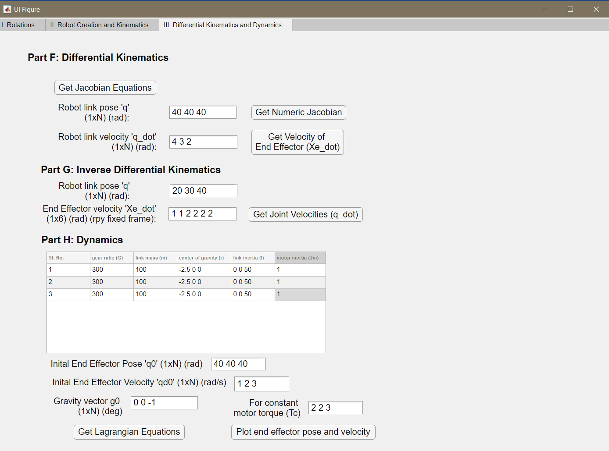

# Manipulator Toolbox

Description
---
This toolbox is a user interface to create an 'n' link robot on the GUI to its behaviour in terms of rotation matrices, workspace plots, forward and inverse kinematics, dynamics, etc. on MATLAB using app developer.

Usage
---
Please refer to ```./manual``` folder on how to use it.

Interface Overview
---
A few screenshots of the toolbox are provided below to get an idea about how the interface looks.

1. Tab 1) Rotation Animations


2. Tab 2) Robot Creation and Kinematics


3. Tab 3) Differential Kinematics and Dynamics



Examples of a created robots and their workspace plots:

1. Two Link Planar


2. Three Link


